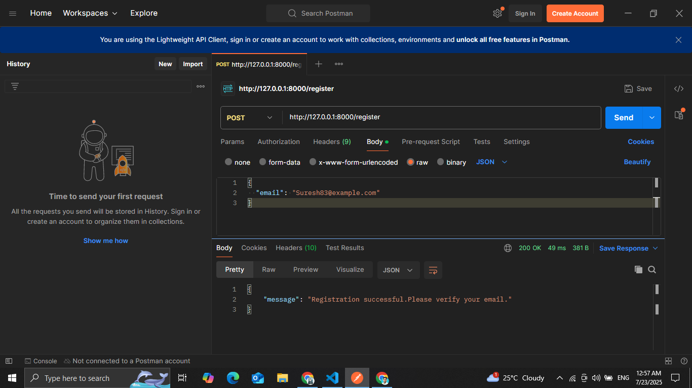
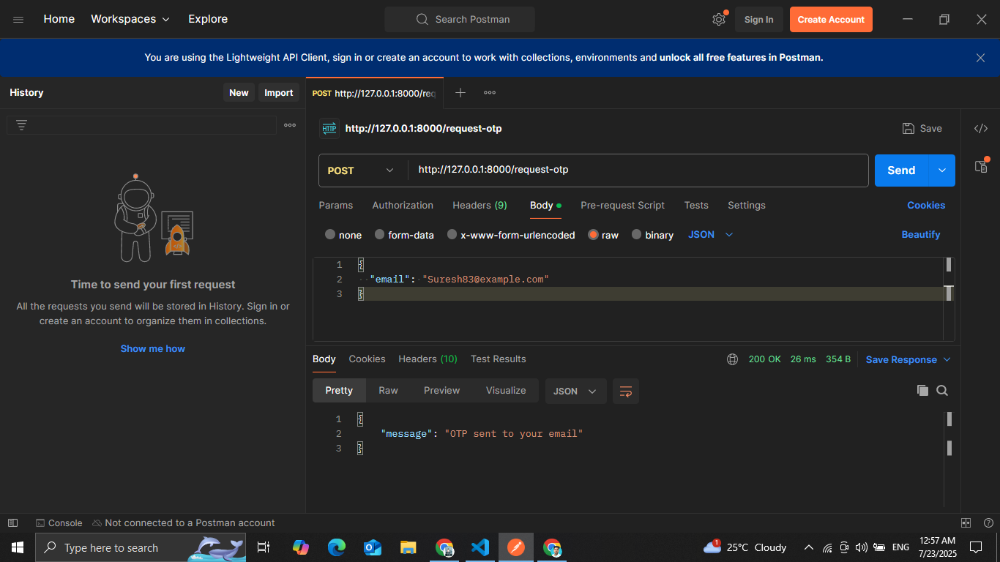
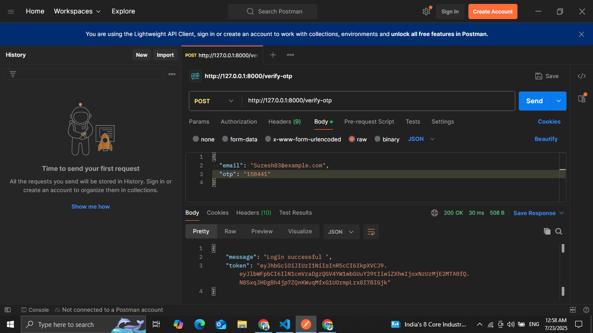
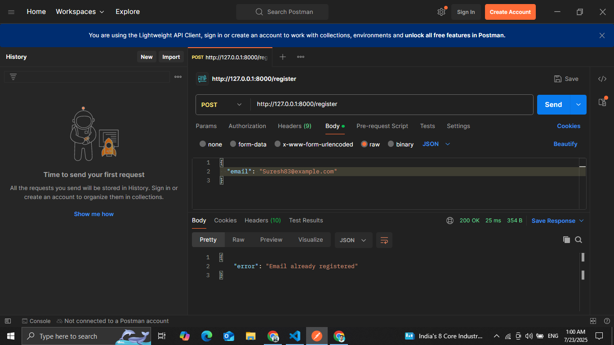

# 🔐 User Login API with Email and OTP Authentication 

This project provides a secure and efficient user authentication system using **Email + OTP verification**. It includes user registration, OTP generation, OTP verification, and JWT-based session management.
---

## 🚀 Technologies Used

- Python
- Django Rest Framework
- SQLite
- JWT (JSON Web Tokens)
- Postman (for testing)

---

## 📦 Features

- ✅ User Registration with Email
- 🔁 OTP Generation & Resending
- 🔐 OTP Verification
- 🛡 Secure JWT Token Generation
- 📧 Console-based OTP (mock email)

---

## 📸 Screenshots

1. Register (📩 Email)

2. Request OTP (🔁 Resend OTP)

3. Verify OTP (🔓 Login) JWT Token on Success

4.Email Already Registered
Already present in database

5.Request OTP for Unregistered Email

